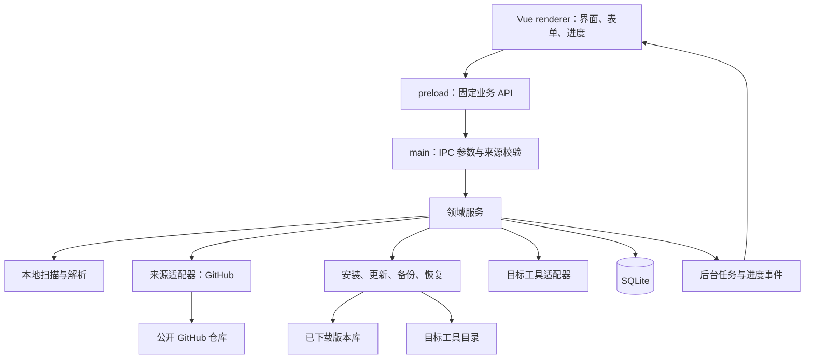

# Skills Manager 技术设计与开发文档

版本：v0.1 设计稿  
整理日期：2026-10-08  
面向：熟悉 Java、Python、Vue，希望独立开发本地 skills 管理应用的开发者

本文中的 skills 指 AI 编程助手使用的 Agent Skills，即以 `SKILL.md` 为入口的目录包。产品按 Windows 桌面应用设计，先支持公开 GitHub 仓库和用户指定的本地目录，后续扩展其他平台。技术方案、接口和数据库是本项目的建议设计；格式约束和第三方工具行为在相关位置标注来源编号，官方资料列在末尾。

## 1. 产品定位与第一版范围

产品目标：让用户在一个本地应用中完成 skills 的发现、查看、下载、安装和维护。

典型流程：

```text
选择本地 skills 目录 → 扫描已安装内容 → 查看详情
添加 GitHub 仓库 → 浏览仓库中的 skills → 预览 → 下载到本地库
选择目标工具/项目 → 安装 → 检查更新 → 预览差异 → 更新或保留当前版本
```

“本地库”保存已经下载的版本；“目标目录”是 Codex、Claude Code 等工具读取 skills 的位置。下载和安装分别记录，用户可以把同一个下载版本安装到多个项目。

| 阶段 | 功能 | 完成标准 |
| --- | --- | --- |
| P0 | 设置目标目录、扫描、搜索、详情预览 | 离线可用，格式错误显示到对应条目 |
| P0 | 添加公开 GitHub 仓库、列出其中的 skills | 支持一个仓库多个 skills，以及根目录包含 SKILL.md 的仓库 |
| P0 | 下载到本地库、安装到一个或多个目录 | 保留完整 skill 目录及来源、提交记录 |
| P0 | 手动检查更新、差异预览、备份、回退 | 本地修改被检测，用户选择保留或备份后替换 |
| P0 | 卸载应用管理的安装副本 | 移入本地备份区，可恢复 |
| P0 | Windows 安装包与错误日志 | 在干净用户环境验证主要流程 |
| P1 | 启用/停用、标签、收藏、内容编辑 | 停用后目录移出工具扫描范围 |
| P1 | 私有仓库、GitLab/Gitee、导入 ZIP | 每个来源分别实现与验证 |
| P1 | macOS/Linux、目录监听、应用自动更新 | 分平台验收 |
| P2 | 在线目录站、账号、团队共享、推荐 | 根据实际使用需求扩展 |

第一版的“发现”页展示用户添加的仓库以及应用附带的来源清单。后续做公共市场时，再引入服务端索引、审核和搜索。管理与下载流程不依赖模型 API，也没有 token 调用费用。

## 2. 技术选型

### 2.1 推荐路线

**Vue 3 + TypeScript + Electron + SQLite。**

Vue 负责界面；Electron 主进程中的 Node.js 代码负责本地文件、下载和数据库；SQLite 保存元数据及操作记录。主要新增学习内容是 TypeScript、Node.js 文件 API 和 Electron 的进程通信。

Electron 使用 Web 技术构建桌面应用，并提供本地系统能力。[S01] `electron-vite` 提供 Vue 与 TypeScript 模板，以及 main/preload/renderer 的构建入口。[S02]

| 层级 | 建议技术 | 具体职责 |
| --- | --- | --- |
| 界面 | Vue 3、TypeScript、Vite | 列表、详情、设置、安装计划与进度 |
| 组件 | Element Plus | 表格、对话框、表单、消息、进度条 |
| 前端状态 | Pinia、Vue Router | 页面状态、筛选条件、导航 |
| 桌面容器 | Electron | 窗口、文件选择器、系统路径、IPC |
| 本地业务 | Node.js + TypeScript | 扫描、来源解析、下载、安装、更新 |
| 数据库 | SQLite + better-sqlite3 | 元数据、安装副本、快照、操作日志 |
| 格式解析 | yaml + Zod | YAML 解析、结构校验、接口参数校验 |
| 内容预览 | markdown-it | 将 skill 正文显示为 Markdown，关闭原始 HTML |
| 下载解压 | 主进程 HTTP 客户端 + 逐条处理的 ZIP 库 | 流式下载、进度、逐文件路径校验 |
| 工程构建 | electron-vite | 开发运行与三类入口构建 |
| 应用打包 | electron-builder | Windows 安装包及后续多平台发行 |
| 测试 | Vitest；打包后的手动冒烟测试 | 解析、路径、安装恢复、平台行为 |

这是一个建议组合。建项时检查这些依赖的当前稳定版本和 `engines`，完成最小打包验证后提交锁文件，开发期间保持版本一致。

### 2.2 其他路线怎么选

| 方案 | 适用情况 | 需要承担的工作 |
| --- | --- | --- |
| Vue + Electron + Node.js | 希望用 Web 技术做完整桌面应用；本方案推荐 | 学习 Node.js、IPC，接受自带浏览器运行时的资源开销 |
| Vue + pywebview + Python + SQLite | 更希望所有本地业务使用 Python | 通过 JS/Python 桥调用业务，验证 WebView、Python 依赖和打包环境 |
| Vue + Tauri + Rust | 愿意学习 Rust，并关注桌面运行时体积 | 学习 Rust 工具链和原生接口；使用 Python 时另管理辅助进程 |
| Vue + Spring Boot + Java | 优先做在浏览器打开的本地 Web 工具 | 管理本地服务启动、端口、JRE 分发和接口访问 |

pywebview 提供 JavaScript 与 Python 的双向调用，可用于 Vue 界面配合 Python 本地逻辑。[S03] Tauri 开发需要 Rust 工具链。[S04]

建议先选定一条路线贯穿第一版。如果你更偏好 Python，后文的领域模型、数据库、安装流程可以复用，将 Electron IPC 换成 pywebview 的 API 桥即可。

### 2.3 已有技术如何发挥作用

- **Vue**：直接用于全部页面。
- **Python**：后续适合复杂内容分析、批量转换、索引等独立任务；也可以作为 pywebview 路线的主业务语言。
- **Java**：公共目录服务、团队权限、组织同步出现需求后，可使用 Spring Boot 建服务端。
- **React**：本项目界面采用 Vue，已有 React 经验可以帮助理解组件与状态管理。

## 3. Skill 的格式与识别规则

Agent Skills 规范以目录为单位，至少包含 `SKILL.md`；文件由 YAML frontmatter 和 Markdown 正文组成，`name`、`description` 为必填字段。`scripts`、`references`、`assets` 是可选目录，包内也可以有其他资源。[S05]

```text
pdf-summary/
├── SKILL.md
├── scripts/
│   └── extract.py
├── references/
│   └── output-format.md
└── assets/
    └── report-template.md
```

示例由本项目编写：

```markdown
---
name: pdf-summary
description: 提取 PDF 文本并整理成摘要；在用户需要阅读或总结 PDF 时使用。
metadata:
  author: example
  version: "1.0.0"
---

# PDF 摘要

1. 读取用户提供的 PDF。
2. 按 references/output-format.md 整理内容。
3. 输出摘要。
```

按通用规范校验：`name` 长度 1–64，使用小写字母、数字、连字符，避免首尾或连续连字符；最终安装目录名与 `name` 一致；`description` 长度 1–1024。保留可选字段及工具扩展字段，避免保存文件时丢失原始内容。[S05]

本项目的解析策略：

- 解析结果包含 `rawText`、`frontmatter`、`body`、`diagnostics`，保留原文。
- 区分通用规范诊断与目标工具兼容诊断。例如某工具接受的扩展字段，由适配器解释。
- 本地扫描遇到缺字段、YAML 错误、目录名不匹配时，条目仍显示并标注原因。
- 安装前在暂存目录做校验，验证最终目录结构和依赖资源。
- `metadata.version` 仅用于展示。应用跟踪的远程版本使用完整 commit SHA；本地导入使用内容哈希。
- skill 的名称作为工具显示/发现信息；数据库主键使用独立 ID，以支持不同来源的同名条目。
- 下载整个 skill 目录，包含所有普通资源文件。检测正文指向包外的资源并展示兼容诊断。
- 来源的许可信息保留在详情和来源记录中；项目自定义标签存入数据库。

管理器读取和展示包内容；执行 skill 由目标 AI 工具负责。下载安装流程保持为文件操作，包内脚本作为资源保存。

## 4. 总体架构



### 4.1 三类代码的职责

| 位置 | 负责什么 |
| --- | --- |
| renderer | 页面、用户输入、状态与进度展示 |
| preload | 暴露窄接口，例如 listSkills、prepareInstall、commitPlan |
| main | 文件选择、路径校验、数据库、网络请求、业务任务调度 |

前端使用 `window.skillsApi` 调用业务 API。文件访问只通过主进程按已登记目标目录处理，数据库由一个本地服务拥有。

Electron 官方建议开启 context isolation 和进程 sandbox，校验 IPC sender，并避免向页面直接暴露完整 Electron API。[S01] 本方案显式配置 `nodeIntegration: false`、`contextIsolation: true`、`sandbox: true`。preload 保持小型桥接层，打包为兼容 sandbox 的单一 CommonJS 文件；共享类型使用类型导入。[S09]

### 4.2 业务模块

| 模块 | 主要功能 |
| --- | --- |
| SkillParser | frontmatter 解析、通用规则、正文与诊断 |
| LocalScanner | 扫描已登记根目录，识别副本和外部变化 |
| SourceService | 添加来源、拉取仓库目录、缓存目录信息 |
| DownloadService | 固定提交下载、解压、完整性检查、创建快照 |
| InstallService | 生成安装计划、冲突检查、目录换位、写安装记录 |
| UpdateService | 获取新提交、比较内容、生成更新计划 |
| TargetAdapter | 工具路径候选、目标规则、安装后验证指引 |
| JobService | 任务排队、取消、阶段进度、错误与重试 |
| RecoveryService | 启动时对账，处理未完成的文件与数据库操作 |

扫描、下载、复制使用异步 I/O；解压和大量哈希计算放到 worker。第一版只允许一个安装变更任务提交，SQLite 使用短事务，下载期间不持有数据库事务。

## 5. 目录与文件布局

应用数据根目录通过 Electron `app.getPath('userData')` 获取，名称由应用配置确定。[S10] 路径在业务服务中注入，避免在页面中拼接固定用户名。

```text
<userData>/
├── manager.db
├── settings.json
├── library/
│   └── <snapshot-id>/
│       └── pdf-summary/
│           ├── SKILL.md
│           └── ...
├── cache/
│   ├── catalog/
│   └── downloads/
└── logs/
```

目标目录及事务辅助目录示例：

```text
<project>/.agents/
├── skills/                          # 目标工具读取
│   └── pdf-summary/
└── .skills-manager/<target-id>/      # 位于扫描根目录之外
    ├── staging/<operation-id>/
    ├── backups/<operation-id>/
    └── inactive/<installation-id>/
```

辅助目录放在目标目录旁边，并验证位于同一文件系统，便于目录换位。临时下载完成后先复制到该暂存区，再发布到目标目录。目标目录与辅助目录应保持互不包含，避免扫描到半成品、备份或已停用副本。

本地库保存不可变快照；用户的实际安装副本可以发生修改。已安装副本依赖的基准快照及可恢复操作所引用的快照，在清理缓存时保留。备份区的清理使用独立操作和保留策略。

### 5.1 目标工具适配

| 目标 | 路径信息 | 产品行为 |
| --- | --- | --- |
| Claude Code 个人目录 | `~/.claude/skills/<name>/SKILL.md` [S06] | 提供候选根目录，按实际用户目录解析 |
| Claude Code 项目目录 | `<project>/.claude/skills/<name>/SKILL.md` [S06] | 用户选择项目后生成根目录 |
| Codex 项目目录 | 上游迁移参考使用 `<project>/.agents/skills/<name>/SKILL.md` [S07] | 作为候选路径，记录实际工具版本并做发现验证 |
| Codex 用户目录 | 路径由实际安装版本及配置确定 | 用户指定根目录；界面可提供 `.agents/skills`、`CODEX_HOME/skills` 候选并验证 |
| 自定义工具 | 用户指定目录 | 使用通用格式检查，发现规则由用户配置 |

`~` 是用户主目录记法，落盘时使用绝对路径。官方 Codex 安装脚本仍使用 `CODEX_HOME/skills` 作为默认安装位置，[S08] 因此项目路径参考与用户安装脚本分别记录，避免把候选目录当作所有版本统一的加载规则。

适配器存储：`adapterId`、`adapterRevision`、`observedToolVersion`、候选路径、名称限制和验证指引。Claude Code 的同步目录等由工具自身维护的区域标记为只读观察区域。[S06]

“文件已安装”表示文件发布成功；“工具已识别”需要目标工具的列表/会话验证。初版提供验证指引和待验证状态，后续按稳定接口实现自动验证。

## 6. 数据模型

将“来源中的 skill”“已下载的版本”“安装在某个位置的副本”分别记录，支持多来源、多版本和多个目标。

```text
sources 1 ── N skills 1 ── N snapshots
                    1 ── N installations N ── 1 targets
operations 记录各次变更及其恢复信息
```

核心字段设计：

| 表 | 主要字段 | 用途 |
| --- | --- | --- |
| sources | id、provider、canonical_url、track_ref、resolved_ref | 仓库或本地导入来源 |
| skills | id、source_id、repo_path、name、description、tags_json | 来源中的 skill；repo_path 允许为空，表示仓库根目录 |
| snapshots | id、skill_id、revision、tree_hash、storage_relpath | 不可变版本；revision 为 commit SHA 或本地导入标识 |
| targets | id、adapter_id、scope、root_path、root_key、helper_path | 已登记的物理安装根目录 |
| installations | id、skill_id、target_id、relative_dir、slot_key、base_snapshot_id、ownership、state | 一个实际安装副本，或扫描得到的外部副本 |
| operations | id、idempotency_key、type、status、payload_json、error_json | 安装计划、文件操作阶段及恢复信息 |

下面是可用于初版迁移的 SQL 草案，应用层另外校验枚举值及 JSON 数据：

```sql
PRAGMA foreign_keys = ON;

CREATE TABLE sources (
  id TEXT PRIMARY KEY,
  provider TEXT NOT NULL,
  canonical_url TEXT NOT NULL,
  track_ref TEXT NOT NULL DEFAULT '',
  resolved_ref TEXT,
  created_at TEXT NOT NULL,
  UNIQUE(provider, canonical_url, track_ref)
);

CREATE TABLE skills (
  id TEXT PRIMARY KEY,
  source_id TEXT NOT NULL REFERENCES sources(id),
  repo_path TEXT NOT NULL DEFAULT '',
  name TEXT NOT NULL,
  description TEXT NOT NULL DEFAULT '',
  metadata_json TEXT NOT NULL DEFAULT '{}',
  tags_json TEXT NOT NULL DEFAULT '[]',
  catalog_revision TEXT,
  updated_at TEXT NOT NULL,
  UNIQUE(source_id, repo_path)
);

CREATE TABLE snapshots (
  id TEXT PRIMARY KEY,
  skill_id TEXT NOT NULL REFERENCES skills(id),
  revision TEXT NOT NULL,
  tree_hash TEXT NOT NULL,
  storage_relpath TEXT NOT NULL,
  created_at TEXT NOT NULL,
  UNIQUE(skill_id, revision, tree_hash)
);

CREATE TABLE targets (
  id TEXT PRIMARY KEY,
  adapter_id TEXT NOT NULL,
  adapter_revision TEXT NOT NULL,
  observed_tool_version TEXT,
  scope TEXT NOT NULL,
  root_path TEXT NOT NULL,
  root_key TEXT NOT NULL UNIQUE,
  helper_path TEXT NOT NULL,
  created_at TEXT NOT NULL
);

CREATE TABLE installations (
  id TEXT PRIMARY KEY,
  skill_id TEXT REFERENCES skills(id),
  target_id TEXT NOT NULL REFERENCES targets(id),
  relative_dir TEXT NOT NULL,
  slot_key TEXT NOT NULL,
  observed_name TEXT,
  base_snapshot_id TEXT REFERENCES snapshots(id),
  ownership TEXT NOT NULL DEFAULT 'external',
  state TEXT NOT NULL DEFAULT 'active',
  last_observed_hash TEXT,
  last_scanned_at TEXT,
  UNIQUE(target_id, slot_key)
);

CREATE TABLE operations (
  id TEXT PRIMARY KEY,
  idempotency_key TEXT NOT NULL UNIQUE,
  type TEXT NOT NULL,
  status TEXT NOT NULL,
  payload_json TEXT NOT NULL,
  error_json TEXT,
  created_at TEXT NOT NULL,
  updated_at TEXT NOT NULL
);

CREATE INDEX idx_installations_skill ON installations(skill_id);
CREATE INDEX idx_operations_status ON operations(status);
```

字段规则：

- `root_key` 对已存在路径使用规范化的真实路径；目标尚未创建时解析最近存在的父目录。MVP 对 Windows 路径大小写冲突采取保守检测，并重新检查 junction/reparse point。
- `slot_key` 按目标文件系统规则归一化目录名，同一物理目录只登记一次。
- `ownership` 为 `managed` 或 `external`。扫描发现的旧目录先按 external 记录；用户选择接管时生成基准快照，再建立来源关联。
- `state` 为 `active`、`disabled`、`missing`。格式错误、工具发现状态和内容变更诊断单独返回。
- 同名安装冲突按目标目录处理：保留现有副本、替换已有受管副本，或选择其他目标。展示名和标签存入数据库，安装目录遵循 skill 名称约束。
- `track_ref` 为空时，来源跟踪仓库默认分支；每次检查重新获取默认分支，`resolved_ref` 保存本次解析结果。
- `tree_hash` 根据排序后的相对路径、文件类型及字节哈希生成；资源文件增加、删除、修改都影响结果。
- 外部文件变化会触发重新扫描。数据库记录需与实际目录对账，目录丢失时标记 missing 并保留来源信息。
- 数据库使用编号迁移文件，记录 schema version。启用外键；短事务并可配置 WAL。[S11]

## 7. 本地接口设计：Electron IPC

初版使用 IPC 传递业务请求。将它理解成 Vue 调用的本地服务层即可。

接口都返回结构化结果：

```ts
type ApiResult<T> =
  | { ok: true; data: T }
  | { ok: false; error: { code: string; message: string; retryable: boolean } }

type JobRef = { jobId: string }

type PrepareInstallInput = {
  snapshotId: string
  targetId: string
}

type InstallPlan = {
  planId: string
  expiresAt: string
  snapshotId: string
  targetId: string
  displayDestination: string
  expectedCurrentHash: string | null
  conflicts: Array<{
    code: string
    message: string
    choices: string[]
  }>
}

type CommitPlanInput = {
  planId: string
  idempotencyKey: string
  resolution: 'keep-existing' | 'install' | 'backup-and-replace'
}

type JobProgress = {
  jobId: string
  stage: 'resolving' | 'downloading' | 'validating' | 'staging' | 'applying' | 'done'
  bytesDone?: number
  bytesTotal?: number
  message: string
}
```

接口清单：

| IPC 方法 | 输入 | 返回/作用 |
| --- | --- | --- |
| targets.chooseAndAdd | adapterId、scope | 主进程打开目录选择器，返回 targetId |
| targets.list | 无 | 已登记目录及可访问状态 |
| skills.scan | targetId | jobId，扫描完成后列表刷新 |
| skills.list | keyword、targetId、sourceId、分页参数 | skill 和安装摘要 |
| skills.detail | skillId 或 installationId | 元数据、正文、文件清单、诊断 |
| sources.add | GitHub 仓库输入、可选 ref | sourceId；获取默认分支 |
| sources.refresh | sourceId | jobId；刷新目录 |
| snapshots.download | skillId、catalogRevision | jobId；生成固定提交快照 |
| installs.prepare | snapshotId、targetId | InstallPlan；准备文件并检查冲突 |
| plans.commit | planId、idempotencyKey、resolution | jobId；按主进程保存的计划执行 |
| updates.check | installationId | jobId；返回候选提交与内容变化 |
| updates.prepare | installationId、snapshotId | 差异与更新计划 |
| installs.prepareRemove | installationId | 卸载计划，写明备份位置 |
| installs.prepareRestore | operationId | 恢复计划，并检查新冲突 |
| jobs.get / jobs.cancel | jobId | 获取状态；请求取消可取消阶段 |
| settings.get / settings.save | 经校验的设置 | 设置与生效结果 |

计划存入 `operations.payload_json`，至少包含目标路径、helper 路径、快照、旧内容哈希、拟执行步骤、备份路径和过期时间。提交时重验目录和当前哈希。前端提交计划 ID 和选择，主进程以自己保存的计划作为执行依据。

进度事件只携带结构化数据。preload 包装订阅并返回取消订阅函数，过滤 jobId，页面销毁时清理。下载展示字节进度；验证/复制展示阶段或文件计数，避免在未知总量时显示虚构百分比。

错误码建议：`INVALID_SKILL`、`PATH_CONFLICT`、`LOCAL_CHANGES`、`PLAN_STALE`、`SOURCE_NOT_FOUND`、`RATE_LIMITED`、`NETWORK_ERROR`、`PERMISSION_DENIED`、`RECOVERY_REQUIRED`。

## 8. 本地扫描与 GitHub 下载

### 8.1 本地扫描

扫描范围只包含用户登记的目标根目录。初版检查根目录下各 skill 子目录，进入已识别包读取文件清单；有嵌套 `SKILL.md` 时记录诊断。目录监听作为后续优化，P0 提供手动刷新。

步骤：读取目录 → 找到入口 → 解析 frontmatter → 收集包内资源 → 对已有副本计算变更状态 → 更新索引 → 返回诊断。

本地只扫描文件，保持外部副本原样。接管既有目录是明确的产品操作：展示内容、记录基准快照和真实路径，再赋予受管状态。

### 8.2 来源与下载流程

GitHub 适配器的数据输入使用 `owner`、`repo`、`ref`、`repoPath`。支持粘贴仓库 URL，解析后展示字段。遇到带斜线的分支与子目录歧义时，让用户在来源表单中明确 ref 和目录。

```text
输入仓库
  → 获取仓库信息与默认分支
  → 将所选 ref 解析为完整 commit SHA
  → 按该提交获取 Git tree
  → 查找 SKILL.md，生成目录候选
  → 用户选择 skill
  → 按相同 SHA 下载仓库 ZIP
  → 检查归档并提取所选包
  → 校验并计算 tree_hash
  → 存入不可变本地库，登记 snapshot
```

API 请求结构：

```text
GET /repos/{owner}/{repo}
GET /repos/{owner}/{repo}/commits/{encoded-ref}
GET /repos/{owner}/{repo}/git/trees/{tree-sha}?recursive=1
GET /repos/{owner}/{repo}/zipball/{commit-sha}
```

GitHub Git Trees API 的递归结果可能标记 `truncated: true`，此时需要按子树获取剩余内容。[S12] ZIP 下载接口支持仓库归档，并返回下载重定向。[S13]

本项目的处理要求：

- 目录索引、正文预览和下载使用同一个固定提交，防止中途分支变化造成内容不一致。
- 根目录 `SKILL.md` 对应 `repoPath=''`；多包仓库逐个展示候选。嵌套在另一个 skill 内的候选标记为嵌套并默认不选中。
- 按提交缓存仓库归档，同一次下载可提取多个 skill；公开 GitHub ZIP 路线让用户直接使用 HTTP 下载。
- `truncated` 时按子树补全；达到本产品的扫描限制时显示“索引未完成”，让用户选择较小目录范围。
- 文件大小、下载大小、解压后总量和条目数设置可配置上限。作为初始产品参数可试用：压缩包 100 MB、展开 300 MB、最多 20,000 条目；这些数值是本项目默认值，需按真实仓库调整。
- 解压逐条校验：绝对路径、`..`、盘符/UNC、Windows 设备名、ADS、大小写重名、链接及设备类型条目都进入不兼容诊断。P0 安装仅复制普通目录和文件。
- 检查 Git tree 中的 symlink/submodule；包依赖外部子模块或 Git LFS 内容时显示兼容诊断，后续版本提供专门获取流程。
- 下载失败保留错误原因与重试入口；处理超时、取消、限流和重定向。请求重定向按可信 GitHub 下载域检查，凭据只发送给对应来源。
- 下载暂存内容通过校验后再发布到本地库，扫描与安装读取完整快照。

## 9. 安装、更新与恢复

### 9.1 首次安装

1. 从已下载快照生成安装计划，确定目标目录名。
2. 校验根目录、实际路径、写入能力、空间和同名冲突。
3. 将包复制到目标旁的 staging，逐文件校验哈希。
4. 记录 prepared 操作及完整恢复信息。
5. 获取安装变更锁，重新校验目标状态，记录 applying 阶段。
6. 把 staging 中的完整目录发布到目标位置。
7. 在 SQLite 短事务中登记安装副本、基准快照并将操作标记 committed。
8. 展示成功结果及目标工具验证入口。

第一版采用复制安装。每个工具和项目拥有自己的副本，改动与版本可以独立跟踪。符号链接安装可作为后续高级模式，按平台和工具单独验收。

### 9.2 更新规则

使用三个版本做比较：

```text
B = 上次安装的基准快照
L = 当前目标目录内容
R = 新下载的候选快照
```

| 条件 | 显示和操作 |
| --- | --- |
| L = B，R = B | 内容已是最新，更新来源检查时间 |
| L = B，R ≠ B | 展示差异；确认后备份并替换 |
| L ≠ B，R = B | 本地有修改，上游内容未变 |
| L ≠ B，R ≠ B | 展示冲突；保留当前版本，或备份本地内容后替换 |
| 当前基准未知 | 保持外部观察状态；先建立基准或接管再管理更新 |

仓库 commit 变化但所选 skill 的 tree_hash 一致时，记录来源检查结果，保留原安装内容。P0 使用完整备份后替换；自动三方合并可以放在后续版本。

### 9.3 文件与数据库的一致性

一个 SQLite 事务只覆盖数据库状态。本项目对文件目录变更使用操作日志和启动恢复协议。

```text
created → prepared → applying → committed
                    └→ failed / recovery-required
```

更新时的换位流程：

```text
新版本复制到 staging
  → 日志记录所有预期路径、哈希和步骤
  → 原目标目录移动到同文件系统的 backups
  → 新目录移动到目标位置
  → 校验目标内容
  → 数据库提交安装记录与 committed 状态
```

每次目录移动之前记录该动作意图，完成后记录结果。启动时先扫描未终结操作，根据目标、备份、staging 的实际存在状态和哈希，完成已验证的新安装或恢复原目录。遇到不符合计划的外部修改时保留相关目录，显示恢复页。

两次目录移动之间存在短暂空窗，所以整个流程用“可恢复发布”验收。取消请求在 applying 之前可立即处理；开始目录换位后完成当前恢复协议，再给出结果。

同一目标变更串行执行，应用使用单实例锁。日志覆盖连续点击、应用退出以及文件变更后数据库提交失败等场景。外部工具或编辑器造成的竞争通过提交前与发布前复检尽量发现，发现变化后让旧计划过期。

### 9.4 卸载、停用与恢复

- 卸载受管副本：预览计划后把整个目录移入备份区，再移除对应活动安装记录；记录原快照与目标信息。
- 停用：P1 将受管副本移动到目标扫描根目录之外的 inactive 区域，并更新状态。
- 启用：检查名称冲突后从 inactive 发布回原目标，更新状态。
- 恢复备份：生成新计划，检查目前目标的内容及冲突，再执行换位流程。

数据库中的开关与真实文件状态保持一致。目标工具已经加载的内容可能需要刷新或新会话，界面显示适配器提供的生效指引。

## 10. 页面设计

| 页面 | 内容与交互 |
| --- | --- |
| 我的 Skills | 名称、描述、来源、安装目标、内容状态；按目标/来源筛选 |
| Skill 详情 | Markdown 正文、资源树、来源、提交、兼容诊断、安装副本列表 |
| 发现 | 已添加仓库中的 skills；搜索、预览、下载与安装 |
| 来源管理 | 添加仓库、指定分支、刷新时间、错误与删除索引 |
| 安装/更新预览 | 所选版本、目标目录、差异、冲突选择、备份信息 |
| 任务中心 | 阶段进度、完成结果、错误、重试、恢复入口 |
| 设置 | 工具根目录、项目目录、缓存与备份、下载参数、日志目录 |

主界面建议采用左侧导航、中间列表、右侧详情。用户可在详情页完成下载与安装。

Markdown 预览使用文本解析，关闭原始 HTML；包内图片通过受控文件接口读取，资源路径限制在包内；外部链接只允许检查后的 HTTP/HTTPS。UI 加载本地打包资源，设置 CSP，并限制页面导航。[S01]

对普通用户显示“来源”“版本”“本地有修改”“更新前备份”等概念；SHA 和详细目录放入高级信息。错误信息包含失败位置和下一步操作，例如“目录当前被占用，请关闭使用该文件的程序后重试”。

## 11. 项目目录建议

```text
skills-manager/
├── docs/
│   └── technical-design.md
├── src/
│   ├── main/
│   │   ├── index.ts
│   │   ├── ipc/
│   │   ├── services/
│   │   ├── adapters/
│   │   │   ├── sources/github.ts
│   │   │   └── targets/
│   │   ├── filesystem/
│   │   ├── jobs/
│   │   ├── workers/
│   │   └── db/
│   │       ├── connection.ts
│   │       └── migrations/
│   ├── preload/
│   │   └── index.ts
│   ├── renderer/
│   │   ├── index.html
│   │   └── src/
│   │       ├── pages/
│   │       ├── components/
│   │       ├── stores/
│   │       └── api/
│   └── shared/
│       ├── types.ts
│       └── schemas.ts
├── tests/
│   ├── parser/
│   ├── filesystem/
│   └── fixtures/
├── electron.vite.config.ts
├── electron-builder.yml
└── package.json
```

领域逻辑写在 services 中；IPC handler 做参数解析、调用服务、转换错误。来源与目标工具适配器分别定义接口，避免将路径和下载规则散落在页面里。

## 12. 从零建项与打包

### 12.1 环境

使用脚手架和构建工具支持的 Node.js LTS，安装 npm 与编辑器。安装原生 SQLite 依赖时，优先使用与所选 Electron/架构匹配的预构建；遇到需要编译的组合，再准备对应 Windows C++ 构建工具链。先做一个空应用加 SQLite 的打包验证，再开发完整功能。

当前目录已有本文档，建议在它的子目录 `desktop` 初始化，避免脚手架覆盖文档：

```powershell
npm create @quick-start/electron@latest desktop -- --template vue-ts
Set-Location .\desktop
npm install
npm run dev
```

这是 electron-vite 官方脚手架命令及 Vue TypeScript 模板用法。[S02] 初始化后按模板实际生成的 scripts 使用命令。

分阶段加入依赖，先加页面，再加本地业务：

```powershell
npm install element-plus pinia vue-router
npm install better-sqlite3 yaml zod markdown-it
npm install -D @types/better-sqlite3 @types/markdown-it vitest
```

脚手架如已包含 electron-builder 就直接复用；需要加入时使用：

```powershell
npm install -D electron-builder
```

### 12.2 SQLite 原生依赖与打包

`better-sqlite3` 是 Node.js SQLite 库。[S11] 将其列为生产依赖，并放在主进程使用；原生模块作为外部依赖打包，配置好原生二进制解包路径。

electron-builder 官方建议通过以下安装钩子让原生依赖匹配 Electron 版本。[S14]

```json
{
  "scripts": {
    "postinstall": "electron-builder install-app-deps"
  }
}
```

这是要合并进现有 scripts 的字段。模板已有相同钩子时直接保留。

发布流程：类型检查 → 构建 → unpacked 包验证 → Windows 安装包 → 干净用户环境验证。使用模板对应命令。electron-builder 提供 Windows NSIS 等打包目标。[S14]

发行注意事项：

- 在 Windows 上验证 Windows 安装包；后续 macOS/Linux 使用对应平台构建和测试。
- 运行后的数据库、日志、缓存都写到用户数据路径或已登记目标辅助目录。
- 测试安装包升级后用户数据仍可读取，并验证 schema migration。
- 面向公开发行时配置应用签名；自动更新服务作为单独里程碑验证。
- 原生模块在开发环境与 Electron 环境可能使用不同 ABI。纯逻辑单测避免加载生产 SQLite 二进制，数据库与打包检查在匹配的运行时完成。

## 13. 开发顺序与验收

以个人全职投入粗估，第一版可安排约 15–25 个有效开发日；这是项目排期假设，学习 Electron、TypeScript 和解决环境问题需要额外预留时间。

| 里程碑 | 工作 | 验收 |
| --- | --- | --- |
| M1：工程与桌面壳 | Vue 页面布局、窄 IPC、SQLite、空包构建 | 一个请求往返成功，打包后能创建并读取数据库 |
| M2：本地管理 | 目录选择、扫描、解析、列表、搜索、详情 | 用正常包、格式错误包和中文路径完成离线流程 |
| M3：来源与下载 | GitHub 来源、固定提交索引、ZIP、快照 | 多包仓库及根目录包可下载，版本记录可追溯 |
| M4：安装与维护 | 计划、冲突、变更检测、备份、更新、恢复 | 修改过的文件被识别，每个中断位置都能恢复 |
| M5：发行 | 安装包、错误页、日志、迁移与冒烟测试 | 干净 Windows 用户环境完成全部主要流程 |

最先动手的一条开发切片：

```text
窗口显示本地列表
  → 点击“选择目录”
  → 主进程返回扫描任务
  → 解析 SKILL.md
  → 列表和详情显示结果
```

下一条切片再增加“输入一个公开 GitHub 仓库 → 下载一个包 → 安装”。每条切片都把 UI、服务和文件结果做通，再增加更多页面。

### 13.1 有价值的测试

| 类别 | 场景 |
| --- | --- |
| 解析 | BOM、CRLF、中文 description、缺字段、YAML 错误、扩展字段保留 |
| 路径 | 中文/空格路径、大小写冲突、归档越界、链接与 junction、重叠目标目录 |
| 来源 | 默认分支非 main、分支含斜线、根目录包、多包、嵌套候选、索引截断 |
| 网络 | 超时、限流、取消、下载不完整、同一归档多个包 |
| 更新 | 只修改资源文件、删除资源、本地修改、提交变化但包内容不变 |
| 恢复 | 原目录移动后退出、新目录发布后退出、数据库提交失败、重复提交 |
| 平台 | 目录被占用、空间不足、写入权限、安装包中原生 SQLite 加载 |
| 对账 | 外部移动/删除目录、元数据过期、备份恢复发生同名冲突 |

解析和计划单测使用 fixtures；文件操作集成测试使用专用临时目录；网络测试使用固定响应。异常中断通过在恢复步骤边界注入退出点验证。真实目标工具目录用于最后的明确安装验收。

## 14. 扩展 Python 或 Java 的时机

Python 扩展任务可放入独立可执行进程，通过 stdin/stdout JSON Lines 传递 jobId、输入、结果、进度和取消信号。启动与退出由桌面主进程管理，写入目标目录的动作仍由安装服务统一协调。

Java 服务端适合公共目录、组织账号和同步。服务端保存来源索引与团队配置，本地应用保留离线数据及本地文件操作。远程目录格式可提前定义为：来源、仓库路径、固定提交、显示元数据、更新时间。

现阶段学习顺序建议：TypeScript 基础 → Node.js 异步文件操作 → Electron IPC → SQLite 与迁移 → 固定提交下载 → 安装恢复协议 → 打包。

## 15. 官方资料与查证范围

以下资料在 2026-10-08 查阅。资料定位说明第三方行为，本文的业务接口、数据库与开发排期是本项目的设计建议。版本升级时重新检查目标工具目录及原生依赖兼容性。

| 编号 | 官方资料 | 本文使用范围 |
| --- | --- | --- |
| S01 | Electron Security | 桌面系统能力、进程隔离、IPC、导航、CSP |
| S02 | electron-vite Getting Started | Vue/TypeScript 模板、初始化命令 |
| S03 | pywebview Usage / Application architecture | JavaScript/Python 桥 |
| S04 | Tauri Prerequisites | Rust 工具链要求 |
| S05 | Agent Skills Specification | 目录入口、frontmatter、命名约束 |
| S06 | Claude Code Skills | 本地个人/项目路径、工具维护的同步区域 |
| S07 | OpenAI skills：Migration Differences | Codex 项目路径示例；该参考内部校验日期为 2026-04-20 |
| S08 | OpenAI skill-installer 源码 | 默认安装到 CODEX_HOME/skills |
| S09 | electron-vite Development | preload 桥、sandbox 的构建要求 |
| S10 | Electron app API | userData 获取 |
| S11 | better-sqlite3 官方仓库 | SQLite 库、事务、WAL |
| S12 | GitHub REST Git Trees | 目录树、递归截断处理 |
| S13 | GitHub REST Repository Contents | 固定 ref 内容及 ZIP 归档接口 |
| S14 | electron-builder 稳定版文档 | 原生依赖重建、安装包 |

资料地址：

```text
S01 https://www.electronjs.org/docs/latest/tutorial/security
S02 https://electron-vite.org/guide/
S03 https://pywebview.flowrl.com/guide/usage
    https://pywebview.flowrl.com/guide/architecture
S04 https://v2.tauri.app/start/prerequisites/
S05 https://agentskills.io/specification
S06 https://code.claude.com/docs/en/skills
S07 https://github.com/openai/skills/blob/main/skills/.curated/migrate-to-codex/references/differences.md
S08 https://github.com/openai/skills/blob/main/skills/.system/skill-installer/scripts/install-skill-from-github.py
S09 https://electron-vite.org/guide/dev.html
S10 https://www.electronjs.org/docs/latest/api/app
S11 https://github.com/WiseLibs/better-sqlite3
S12 https://docs.github.com/en/rest/git/trees
S13 https://docs.github.com/en/rest/repos/contents
S14 https://www.electron.build/v26/docs/
```